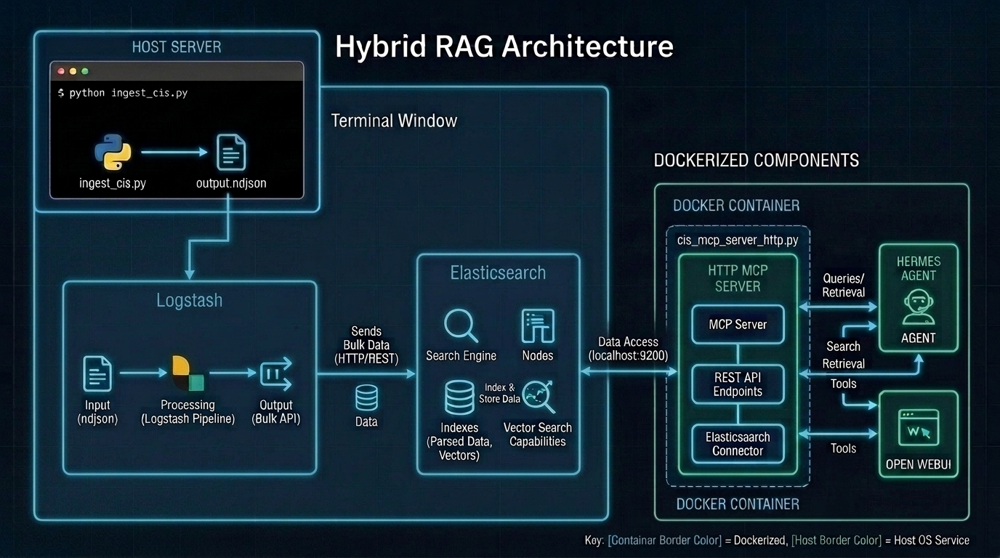
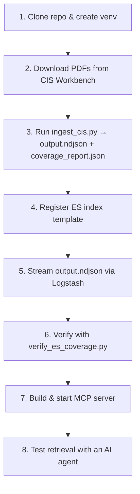

# CIS Benchmark Hybrid RAG & MCP Server

A self-hosted **Hybrid RAG (Retrieval-Augmented Generation)** pipeline that parses official **CIS (Center for Internet Security) Benchmark** PDFs, verifies that every recommendation was captured, embeds each rule in full, indexes it into **Elasticsearch**, and exposes it to AI agents through a **Model Context Protocol (MCP)** HTTP server.

### ✨ Key Features

- **No rule left behind**: the parser builds the official list of recommendations from the PDF itself (bookmarks + Table of Contents), checks its output against that list, recovers anything the state machine missed, and writes a coverage report. `--strict` fails the run if any official rule has no body.
- **One document per rule**: every CIS recommendation is a single, undivided JSON document (title, profile, description, audit, remediation, references), so the LLM always receives complete, version-specific context.
- **Whole-rule embeddings**: `all-MiniLM-L6-v2` reads only 256 tokens, while a CIS rule averages ~3,600 characters. Each rule is split into passages that fit the window and every passage gets its own vector, so audit commands and remediation steps are searchable, not just the first ~1,000 characters.
- **Hybrid retrieval**: nested k-NN over passage vectors combined with hard metadata filters (OS, CIS level, profile, automation status), so a question about *"password policy"* on **RHEL 9, Level 1** never returns Windows GPO guidance.
- **End-to-end verification**: `verify_es_coverage.py` confirms every parsed rule reached the index with passage vectors, and works with self-signed Elasticsearch clusters.

### 📐 System Architecture



1. **Parser & Embeddings** — [ingest_cis.py](1_parser_and_ingest/ingest_cis.py)
   - Extracts text per page with `pdfplumber` and reads the official rule list from the PDF bookmarks (`pypdf`) and Table of Contents.
   - A line-by-line state machine (`SCANNING → BUFFERING → ACCUMULATING`) detects rule headers with one generic regex (any title wording; Windows `(L1)/(L2)/(NG)/(BL)` tags) and accumulates each rule's content. Only official rule IDs can open a header, so section titles and CIS Controls table rows cannot hijack the next rule.
   - Post-processing extracts `sections` (audit, remediation) and `metadata` (profile applicability, CIS level).
   - Each rule is split into token-bounded passages and embedded into **384-dimensional** vectors, then written as one JSON document per line to `output.ndjson`.

2. **Logstash Ingestion Pipeline** — [cis_benchmark.conf](2_elasticsearch_config/cis_benchmark.conf)
   Reads `output.ndjson` line by line, strips Logstash metadata and bulk-indexes into the `cis_benchmark` index with `document_id = %{rule_id}-%{[metadata][source]}`, so the same rule ID from different benchmarks (e.g. `windows_server_2022` and `rhel_9`) stays distinct.

3. **HTTP MCP Server** — [cis_mcp_server_http.py](3_mcp_server/cis_mcp_server_http.py)
   A FastMCP server (MCP Python SDK 1.x) in Docker, `streamable-http` transport on port `8765`. It embeds incoming queries with the same `all-MiniLM-L6-v2` model (baked into the image, CPU-only PyTorch), runs nested k-NN on `passages.vector` with optional metadata filters, and exposes 6 MCP tools to AI agent clients.

---

## ⚖️ Copyright & Compliance Disclaimer (Bring Your Own Data)

> [!IMPORTANT]
> **This repository DOES NOT contain any copyrighted CIS Benchmark PDF documents.**
> To comply with the Center for Internet Security (CIS) Terms of Use, you must download the PDF documents directly from the official [CIS Workbench](https://workbench.cisecurity.org/) portal. The parser tool provided here is intended to be run locally in a self-hosted environment (*Bring Your Own Data*).

---

## 📁 Repository Structure

```text
├── 1_parser_and_ingest/             # PDF Extraction & Ingestion Pipeline
│   ├── cis_benchmarks/              # Place your downloaded official CIS PDFs here (gitignored)
│   ├── ingest_cis.py                # Ground-truth driven parser, coverage report, passage embeddings
│   ├── verify_es_coverage.py        # Checks every parsed rule reached Elasticsearch with passage vectors
│   ├── pick_retrieval_tests.py      # Builds deep-text test questions to validate retrieval
│   └── requirements_ingest.txt      # Ingestion dependencies (install CPU-only torch first)
│
├── 2_elasticsearch_config/          # Database Schema Mapping & Logstash Pipelines
│   ├── index_template.json          # Mapping: keyword metadata, nested passages.vector, text_embedding
│   └── cis_benchmark.conf           # Logstash pipeline (NDJSON -> cis_benchmark index)
│
├── 3_mcp_server/                    # Model Context Protocol API Server
│   ├── Dockerfile.mcp               # Image with CPU-only PyTorch and the embedding model pre-downloaded
│   ├── docker-compose.yml           # Compose deployment (host network, reads 3_mcp_server/.env)
│   ├── .env.example                 # Template for .env (ES_* settings, also read by verify_es_coverage.py)
│   ├── requirements_mcp.txt         # Server dependencies (mcp<2, sentence-transformers, elasticsearch)
│   ├── cis_mcp_server_http.py       # FastMCP server (streamable-http transport)
│   └── SKILL.md                     # AI agent search routing guidelines
│
├── .gitignore
└── README.md
```

Generated files (gitignored): `1_parser_and_ingest/output.ndjson`, `1_parser_and_ingest/coverage_report.json`, and for `--only` runs `output.<source>.ndjson` / `coverage_report.<source>.json`.

## ⚙️ Prerequisites & Dependencies

1. **Python**: 3.10+ (3.11/3.12 recommended). RHEL 9 ships Python 3.9 as `python3`, which is end-of-life and gets older `sentence-transformers` releases; install a newer one with `sudo dnf install python3.12`.
2. **Memory**: at least 8 GB RAM is recommended for embedding with `all-MiniLM-L6-v2` on CPU.
3. **Elasticsearch 8.11 or newer**: the index template maps an indexed `dense_vector` inside the nested `passages` field, which older versions reject.
4. **Logstash**: configured with [cis_benchmark.conf](2_elasticsearch_config/cis_benchmark.conf).
5. **Docker**: Docker Engine and Docker Compose for the MCP server.

### 🎯 Supported Benchmarks (Scope of Ingestion)
The parser is pre-configured for the following official CIS Benchmark PDFs. File names inside `1_parser_and_ingest/cis_benchmarks/` must match:

| Source ID | File name |
|---|---|
| `windows_server_2025` *(opt-in)* | `CIS_Microsoft_Windows_Server_2025_Benchmark_v2.0.0.pdf` |
| `windows_server_2022` | `CIS_Microsoft_Windows_Server_2022_Benchmark_v4.0.0.pdf` |
| `windows_server_2019` | `CIS_Microsoft_Windows_Server_2019_Benchmark_v4.0.0.pdf` |
| `windows_server_2016` | `CIS_Microsoft_Windows_Server_2016_Benchmark_v3.0.0.pdf` |
| `rhel_9` | `CIS_Red_Hat_Enterprise_Linux_9_Benchmark_v2.0.0.pdf` |
| `rhel_8` | `CIS_Red_Hat_Enterprise_Linux_8_Benchmark_v4.0.0.pdf` |
| `rhel_7` | `CIS_Red_Hat_Enterprise_Linux_7_Benchmark_v4.0.0.pdf` |

`windows_server_2025` is **opt-in**: a default run skips it, even when its PDF is in the folder, so `output.ndjson` keeps the same benchmarks as before. Process it on its own with `--only windows_server_2025` (see [Running a single benchmark](#running-a-single-benchmark-eg-windows-server-2025)).

> [!TIP]
> To import other versions (e.g. RHEL 9 v2.1.0), update the entries in the `PDF_FILES` list at the top of [ingest_cis.py](1_parser_and_ingest/ingest_cis.py) to match your file names. Run with `--no-embed --strict` first to confirm the coverage report shows no missing rules.

---

## ⚡ Deployment & Workflow Guide



### Step 1: Clone the Repo & Set Up a Virtual Environment
```bash
git clone https://github.com/your-username/cis-benchmark-mcp-rag.git
cd cis-benchmark-mcp-rag

python3.12 -m venv venv
source venv/bin/activate            # Windows: .\venv\Scripts\activate

# CPU-only PyTorch first: the default Linux wheel is the CUDA build
# (~555 MB plus >1 GB of nvidia-* packages). Skip this line only if you
# want to embed on an NVIDIA GPU.
pip install torch --index-url https://download.pytorch.org/whl/cpu
pip install -r 1_parser_and_ingest/requirements_ingest.txt
```

| Task | Packages needed |
|---|---|
| Parsing, chunking and coverage check (`--no-embed`) | `pdfplumber`, `pypdf` only (~75 MB, no torch) |
| Full run with embeddings | + `sentence-transformers` + CPU-only `torch` |
| `verify_es_coverage.py` | + `elasticsearch` |

### Step 2: Download the CIS Benchmark PDFs
1. Download the benchmarks you need from the [CIS Workbench Portal](https://workbench.cisecurity.org/).
2. Place the `.pdf` files inside `1_parser_and_ingest/cis_benchmarks/`.

### Step 3: Run Ingestion (Parsing, Coverage Check & Embeddings)
```bash
# Recommended first: quick coverage check, no embeddings, writes no NDJSON
python 1_parser_and_ingest/ingest_cis.py --no-embed --strict

# Full run: parse, verify coverage, embed, write output.ndjson
python 1_parser_and_ingest/ingest_cis.py
```

| Option | Effect |
|---|---|
| `--strict` | Exit with code 1 if any official recommendation has no body |
| `--no-embed` | Skip embeddings (quick coverage check). No NDJSON is written unless `--output` is given |
| `--only rhel_9 [...]` | Process only these sources (including opt-in ones). Writes `output.<source>.ndjson` and `coverage_report.<source>.json`, so the full run's files are never overwritten by a partial run |
| `--pdf-dir`, `--output`, `--coverage-report` | Override the default paths |

#### Running a single benchmark (e.g. Windows Server 2025)
```bash
# 1. Coverage check only (no embeddings, no NDJSON)
python 1_parser_and_ingest/ingest_cis.py --only windows_server_2025 --no-embed --strict

# 2. Full run -> separate files; output.ndjson and coverage_report.json are untouched
python 1_parser_and_ingest/ingest_cis.py --only windows_server_2025
#    1_parser_and_ingest/output.windows_server_2025.ndjson
#    1_parser_and_ingest/coverage_report.windows_server_2025.json
```
To index it, copy that file to the Logstash input path (Step 5) **without deleting the index**. Logstash only adds or updates documents, so rules from the other benchmarks stay in `cis_benchmark`:
```bash
sudo cp 1_parser_and_ingest/output.windows_server_2025.ndjson /etc/logstash/conf.d/output.ndjson
sudo systemctl restart logstash
python 1_parser_and_ingest/verify_es_coverage.py \
    --ndjson 1_parser_and_ingest/output.windows_server_2025.ndjson \
    --coverage-report 1_parser_and_ingest/coverage_report.windows_server_2025.json
```
`verify_es_coverage.py` then reports the other benchmarks in the index as sources not covered by that NDJSON. That is expected and does not fail the run. Search it from the MCP server with `os_filter="windows_server_2025"`.

The pipeline runs these stages for each PDF:
1. **PDF text extraction**: `pdfplumber` text per page, with duplicated bold glyphs removed, page footers dropped and Table of Contents pages detected.
2. **Ground truth**: the official list of recommendations from the PDF bookmarks (`pypdf`) and the Table of Contents.
3. **State-machine parsing**: generic header detection, gated by official rule IDs. It stops at the Appendix, so summary tables don't repeat rules.
4. **Candidate selection & recovery**:
   - The most complete candidate per rule is kept.
   - IDs that are not official recommendations and have no body are dropped.
   - Any official rule the state machine missed is rebuilt from the body pages (`metadata.parse_method = "recovered"`).
   - Content that ran into the next rule is trimmed.
5. **Coverage report**: expected vs parsed counts, recovered, dropped and missing rules. It is printed and saved to `coverage_report.json`. **`MISSING` must be `0`.**
6. **Post-processing**: extracts `sections.audit_text` and `sections.remediation_text`, then `metadata.profile_applicability`. It backfills `metadata.cis_level` from Profile Applicability (RHEL headers carry no level).
7. **Passage embedding**: each rule is split into passages that fit the model's 256-token window:
   - Every passage starts with `rule_id (level) title (status)`.
   - Lines are packed one at a time, and over-long lines are cut at word boundaries.
   - Up to ~32 tokens of overlap are carried over from the previous passage.
   - Every passage is embedded in batches of 64.
8. **Quality report**: per-OS counts, CIS level and automation breakdown, section extraction coverage and passage counts.

Example: the RHEL 9 v2.0.0 benchmark parses to 297 of 297 recommendations, with 100% audit/remediation/profile extraction and 0 missing.

**Document shape** (one line of `output.ndjson`):
```jsonc
{
  "rule_id": "1.1.1.1",
  "rule_title": "Ensure cramfs kernel module is not available",
  "content_for_vector": "1.1.1.1 Ensure cramfs ... (Automated)\nProfile Applicability:\n...",  // full rule text
  "sections": { "audit_text": "...", "remediation_text": "..." },
  "passages": [ { "chunk_id": 0, "vector": [/* 384 floats */] }, ... ],  // searched by the MCP server
  "text_embedding": [/* 384 floats: normalized mean of the passage vectors */],
  "metadata": {
    "cis_level": "L1", "automation_status": "Automated",
    "profile_applicability": ["level_1_server", "level_1_workstation"],
    "source": "rhel_9", "os_family": "linux", "os_name": "Red Hat Enterprise Linux 9",
    "benchmark": "CIS Red Hat Enterprise Linux 9 Benchmark", "version": "v2.0.0",
    "source_pages": [20, 21, 22], "parse_method": "state_machine"   // or "recovered" / "title_only"
  }
}
```

### Step 4: Register the Index Template in Elasticsearch

> [!IMPORTANT]
> Register the template **before** streaming data, so `passages` is mapped as `nested` with an indexed `dense_vector`. A template only applies to **newly created** indices. If `cis_benchmark` already exists from an earlier run, delete it first. Otherwise `passages` stays a plain object and the MCP server can only search the single `text_embedding` vector.

```bash
CA=/etc/elasticsearch/certs/http_ca.crt      # or a readable copy of it

# Only when re-ingesting: remove the old index (also removes rules stored under outdated IDs)
curl --cacert $CA -u elastic -X DELETE "https://127.0.0.1:9200/cis_benchmark"

curl --cacert $CA -u elastic -X PUT "https://127.0.0.1:9200/_index_template/cis_benchmark_template" \
     -H "Content-Type: application/json" \
     -d @2_elasticsearch_config/index_template.json
```

### Step 5: Stream the Dataset via Logstash
```bash
sudo cp 2_elasticsearch_config/cis_benchmark.conf /etc/logstash/conf.d/
sudo cp 1_parser_and_ingest/output.ndjson /etc/logstash/conf.d/
sudo systemctl restart logstash
```
Before copying, edit `hosts`, `user`, `password` and `ca_trusted_fingerprint` in `cis_benchmark.conf`. The pipeline expects the dataset at `/etc/logstash/conf.d/output.ndjson`.

The pipeline:
* **Input**: reads `output.ndjson` from the beginning with the `json` codec. `sincedb_path => "/dev/null"` forces a full re-read on every restart.
* **Filter**: removes Logstash fields (`@timestamp`, `@version`, `host`, `log`, `event`).
* **Output**: bulk-indexes into `cis_benchmark` with `document_id = %{rule_id}-%{[metadata][source]}`.

### Step 6: Verify Every Rule Reached the Index
```bash
python 1_parser_and_ingest/verify_es_coverage.py
```
Elasticsearch settings come from the shell (`ES_HOST`, `ES_USER`, `ES_PASSWORD`, `ES_FINGERPRINT`, `ES_CA_CERT`, `ES_INDEX`). Anything not exported is read from `3_mcp_server/.env`, so the MCP server configuration works as is. Use `--env-file` to point at another file.

For each source, the script reports:
* the official recommendations from `coverage_report.json`
* the rules in `output.ndjson`
* the rules found in the index, and the ones **missing** from it
* **stale** documents in the index that are not in `output.ndjson`
* documents **without passage vectors**

It exits with code 1 in any of these cases:
* a rule is missing from the index
* the index has no nested `passages` mapping
* a document lacks passage vectors
* the index or the cluster cannot be reached

**TLS with self-signed clusters.** The script prints the mode it uses (`TLS verify : ...`):

| Setting | Behaviour |
|---|---|
| `ES_CA_CERT=/path/http_ca.crt` | Full verification against the CA file. Takes precedence over `ES_FINGERPRINT`. |
| `ES_FINGERPRINT=<HTTP CA SHA-256>` | The script reads the certificates the server actually sends. A CA match verifies the chain against that CA. A match on the server certificate pins it. This also works on Python 3.9, where the chain is read with `openssl s_client`. |
| neither | System CA store (fails on a self-signed cluster) |

Get the CA fingerprint with `sudo openssl x509 -fingerprint -sha256 -noout -in /etc/elasticsearch/certs/http_ca.crt`.

### Step 7: Configure and Deploy the MCP Server
1. Create the environment file:
   ```bash
   cp 3_mcp_server/.env.example 3_mcp_server/.env
   ```
2. Edit `3_mcp_server/.env`:
   ```ini
   ES_HOST="https://127.0.0.1:9200"
   ES_USER="elastic"
   ES_PASSWORD="your_strong_password_here"
   ES_INDEX="cis_benchmark"
   ES_FINGERPRINT="your_http_ca_sha256_fingerprint"
   ```
3. Build and start the container. Use `--no-cache` after dependency changes, so a cached `pip install` layer is not reused:
   ```bash
   docker compose -f 3_mcp_server/docker-compose.yml build --no-cache
   docker compose -f 3_mcp_server/docker-compose.yml up -d
   docker compose -f 3_mcp_server/docker-compose.yml logs -f
   ```

The container uses the host network, so the server is available at `http://localhost:8765/mcp`. Connect your AI agent client (e.g. Hermes Agent, OpenWebUI) to that URL.

After the first search, the log should show `kNN search field: passages.vector`. If it shows `text_embedding` with a warning, the index was created without the nested mapping: repeat Steps 4–5, then restart the server (`docker compose -f 3_mcp_server/docker-compose.yml restart`) so it reads the new mapping.

### Step 8: Test Retrieval with an AI Agent
The real test of whole-rule embeddings is a question whose answer appears **only deep in the audit or remediation text**, not in the title or description:
```bash
python 1_parser_and_ingest/pick_retrieval_tests.py --source rhel_9 --count 10
```
The script prints random rules, each with a command/config line taken from more than 1,200 characters into the rule. For each one, ask your MCP-connected agent:

> *"In CIS RHEL 9, which rule's audit or remediation contains `<printed line>`? Give the rule ID."*

The expected rule ID should rank in the top 1–3 `search_cis_benchmark` results (8 of 10 correct or better).

---

## 🧰 Registered MCP Tools Reference

| Tool Name | Query Type | Description | Key Parameters |
|---|---|---|---|
| `search_cis_benchmark` | Hybrid k-NN Search | Nested k-NN over `passages.vector` (each rule returned once, scored by its best passage) with optional metadata pre-filters. Returns rule ID, title, applicability, audit and remediation. | `query`, `cis_level`, `profile`, `os_filter`, `is_automated`, `top_k` |
| `count_cis_rules` | Aggregation / Count | Exact counts of rules matching filter combinations. Use for "how many" questions. | `cis_level`, `profile`, `os_filter`, `is_automated` |
| `breakdown_cis_rules` | Aggregation / Breakdown | Groups rules by top-level section with human-readable category names (e.g. Section 18 → "Administrative Templates"). | `os_filter`, `cis_level`, `profile` |
| `list_cis_rules` | Pagination List | Lists rule IDs and titles page by page. | `os_filter`, `cis_level`, `profile`, `section`, `page`, `page_size` |
| `list_available_sources` | Utility / Catalog | Which OS platforms are indexed and their document counts. Returns the `source_id` values used by `os_filter`. | — |
| `get_cis_statistics` | Global Audit | Total rule counts and L1/L2 distribution, optionally per OS. | `os_filter` |

---

## 🩺 Troubleshooting

| Symptom | Cause | Fix |
|---|---|---|
| CIS controls missing from the index | Parser gaps, or stale documents from an older run | Run `ingest_cis.py --no-embed --strict` and check `MISSING` in the coverage report. Then delete the index, re-register the template, re-run Logstash and `verify_es_coverage.py`. |
| `ModuleNotFoundError: No module named 'mcp.server.fastmcp'` (mcp 2.x) | Image built with mcp 2.x, where FastMCP was renamed | `requirements_mcp.txt` pins `mcp<2`. Rebuild with `docker compose ... build --no-cache`. |
| `pip` downloads `torch-...manylinux...whl (554 MB)` and `nvidia-*` | Default CUDA build of PyTorch | Install `torch` from `https://download.pytorch.org/whl/cpu` first. The Dockerfile already does. |
| `CERTIFICATE_VERIFY_FAILED: self-signed certificate in certificate chain` | `ES_FINGERPRINT`/`ES_CA_CERT` not reaching the script (set without `export`) | Put the values in `3_mcp_server/.env` or `export` them. The script prints the TLS mode it uses. |
| `Fingerprints did not match`, with only the server certificate listed | Python 3.9 cannot read the TLS chain | Current `verify_es_coverage.py` reads the chain with `openssl`. Alternatively use `ES_CA_CERT`, or a Python 3.10+ venv. |
| MCP log shows `kNN search field: text_embedding` | Index created without the nested `passages` mapping | Delete the index, re-register the template (ES 8.11+), re-run Logstash, then restart the MCP container. |
| `Docs without passage vectors` > 0 | `output.ndjson` produced with `--no-embed`, or an old file | Re-run `ingest_cis.py` without `--no-embed` and re-ingest. |
