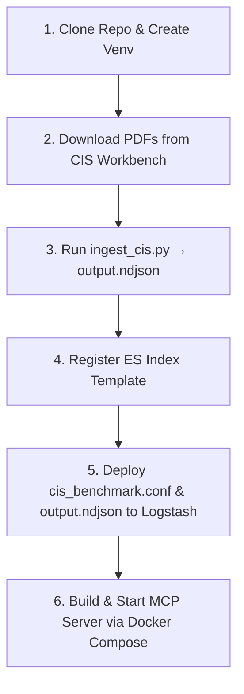

# CIS Benchmark Hybrid RAG & MCP Server

A production-ready **Hybrid RAG (Retrieval-Augmented Generation)** framework designed to parse, deduplicate, generate embeddings, and index hardening guidelines from official **CIS (Center for Internet Security) Benchmarks** into **Elasticsearch**. 

### 🧠 Hybrid RAG & Structure-Aware Chunking

Relying solely on vector search (*dense retrieval*) often fails on technical manuals due to lack of exact constraints, while standard keyword filters (*sparse retrieval*) lack semantic intent. This project implements a true **Hybrid RAG** by merging:

1. **Document-per-Rule Structure-Aware Chunking**: The custom parser [ingest_cis.py](1_parser_and_ingest/ingest_cis.py) extracts each CIS rule as a **single, undivided JSON document** in `output.ndjson`, preserving the complete context of the title, audit checks, and remediation.
2. **Dense Retrieval (Semantic Search)**: Rules are embedded as 384-dimensional vectors (`sentence-transformers`), resolving natural language synonyms (e.g., matching "password age" to "expiration policies"). Each rule is split into passages that fit the model's 256-token window and every passage gets its own vector, so the **whole** rule (description, audit, remediation) is searchable — not just its first ~1,000 characters.
3. **Structured Boolean Filtering**: Queries are hard-filtered in Elasticsearch using metadata criteria (Target OS, CIS Level, Profile, Automation).

This **Hybrid Integration** ensures that querying *"password policy"* restricted to **RHEL 9, Level 1** dynamically intersects vector similarity with exact constraints. It prevents LLMs from hallucinating and serving Windows GPO guidelines to a Linux host, guaranteeing 100% accurate, undivided, and version-specific context in a single query. 

### 📐 System Architecture


1. **Parser & Embeddings**: The script [ingest_cis.py](1_parser_and_ingest/ingest_cis.py) parses official raw CIS PDFs line-by-line using a **3-state state-machine** (`SCANNING → BUFFERING → ACCUMULATING`) that performs **Document-per-Rule Structure-Aware Chunking**. It detects rule headers via dual-format regex (Windows: `1.2.1 (L1) Ensure ...` / Linux: `1.1.1.7 Ensure ...`), accumulates all subsequent content lines (Description, Audit, Remediation, Default Value) until the next header, then runs regex-based post-processing to extract structured `sections` and `metadata` fields. Finally, it batch-encodes each rule's full text into a **384-dimensional dense vector** using `all-MiniLM-L6-v2` and writes the result as one JSON-per-line to `output.ndjson`.

2. **Logstash Ingestion Pipeline**: Logstash reads `output.ndjson` line-by-line using the `json` codec, strips injected Logstash metadata (`@timestamp`, `@version`, `host`), and bulk-indexes documents into Elasticsearch under the `cis_benchmark` index. Each document receives a composite `document_id` of `%{rule_id}-%{[metadata][source]}` to guarantee cross-OS deduplication (e.g., rule `1.1.1` from `windows_server_2022` and `rhel_9` are stored as distinct documents).

3. **HTTP MCP Server**: The FastMCP server [cis_mcp_server_http.py](3_mcp_server/cis_mcp_server_http.py) runs inside a Docker container using `streamable-http` transport on port `8765`. It lazy-loads the same `all-MiniLM-L6-v2` embedding model at startup to vectorize incoming queries, then constructs Elasticsearch k-NN payloads with optional boolean `filter` clauses. It connects to the host-native Elasticsearch via Localhost and exposes 6 specialized MCP tools to AI agent clients.

---

## ⚖️ Copyright & Compliance Disclaimer (Bring Your Own Data)

> [!IMPORTANT]
> **This repository DOES NOT contain any copyrighted CIS Benchmark PDF documents.**
> To comply with the Center for Internet Security (CIS) Terms of Use, you must download the PDF documents directly from the official [CIS Workbench](https://workbench.cisecurity.org/) portal. The parser tool provided here is intended to be run locally in a self-hosted environment (*Bring Your Own Data*).

---

## 📁 Repository Structure

```text
├── 1_parser_and_ingest/       # PDF Extraction & Ingestion Pipeline
│   ├── cis_benchmarks/        # Place your downloaded official CIS PDFs here (gitignored)
│   └── ingest_cis.py          # State-machine parser and vector embedding generator
│
├── 2_elasticsearch_config/    # Database Schema Mapping & Logstash Pipelines
│   ├── index_template.json    # ES mapping template with dense_vector schema configurations
│   └── cis_benchmark.conf     # Logstash integration configuration
│
├── 3_mcp_server/              # Model Context Protocol API Server
│   ├── Dockerfile.mcp         # Docker container packaging script
│   ├── docker-compose.yml     # Docker compose deployment configurations
│   ├── .env.example           # Environment variables configuration template
│   ├── requirements_mcp.txt   # Python dependencies required by the server
│   ├── cis_mcp_server_http.py # Main FastMCP server (HTTP Transport mode)
│   └── SKILL.md               # AI Agent cognitive search routing guidelines
│
├── .gitignore                 # Configured security exclusions for git commits
└── README.md                  # Project documentation (This file)
```

## ⚙️ Prerequisites & Dependencies

To set up and run this project, your environment must satisfy the following:

1. **Python Runtime**: Python 3.10+ (Python 3.11/3.12 recommended).
2. **PyTorch & Transformers Setup**: System memory of at least 8GB RAM is recommended to run local embedding models (`all-MiniLM-L6-v2`).
3. **Database**: Elasticsearch **8.11 or newer** with k-NN/vector search enabled (nested kNN over `passages.vector`). Older versions still work through the single `text_embedding` fallback vector.
4. **Logstash Ingestion Pipeline**: Logstash instance configured with [cis_benchmark.conf](2_elasticsearch_config/cis_benchmark.conf) to stream NDJSON records into Elasticsearch.
5. **Docker**: Docker Engine & Docker Compose installed for running the MCP server container.

### 🎯 Supported Benchmarks (Scope of Ingestion)
The state-machine parser ([ingest_cis.py](1_parser_and_ingest/ingest_cis.py)) is pre-configured and optimized to process the following official CIS Benchmark PDF variants. The file names inside `1_parser_and_ingest/cis_benchmarks/` must match these patterns:

* **Windows Server 2022**: `CIS_Microsoft_Windows_Server_2022_Benchmark_v4.0.0.pdf`
* **Windows Server 2019**: `CIS_Microsoft_Windows_Server_2019_Benchmark_v4.0.0.pdf`
* **Windows Server 2016**: `CIS_Microsoft_Windows_Server_2016_Benchmark_v3.0.0.pdf`
* **Red Hat Enterprise Linux 9**: `CIS_Red_Hat_Enterprise_Linux_9_Benchmark_v2.0.0.pdf`
* **Red Hat Enterprise Linux 8**: `CIS_Red_Hat_Enterprise_Linux_8_Benchmark_v4.0.0.pdf`
* **Red Hat Enterprise Linux 7**: `CIS_Red_Hat_Enterprise_Linux_7_Benchmark_v4.0.0.pdf`

> [!TIP]
> If you wish to import different versions (e.g. Windows Server 2022 v4.1.0 or RHEL 9 v2.1.0), simply update the metadata descriptors inside the `PDF_FILES` list located at the top of the [ingest_cis.py](1_parser_and_ingest/ingest_cis.py) script to match your local file names.

---

## ⚡ Deployment & Workflow Guide



### Step 1: Clone the Repo & Setup Venv
```bash
git clone https://github.com/your-username/cis-benchmark-mcp-rag.git
cd cis-benchmark-mcp-rag

# Setup Python Virtual Environment
python -m venv venv
# Activate on Windows:
.\venv\Scripts\activate
# Activate on macOS/Linux:
source venv/bin/activate

# Install ingestion dependencies
pip install pdfplumber pypdf sentence-transformers torch
```

### Step 2: Download CIS Benchmarks PDF
1. Go to the [CIS Workbench Portal](https://workbench.cisecurity.org/) and download your required benchmark files. Supported targets include:
   * Windows Server 2016 / 2019 / 2022
   * Red Hat Enterprise Linux 7 / 8 / 9
2. Place the downloaded `.pdf` files inside `1_parser_and_ingest/cis_benchmarks/`.

### Step 3: Run Ingestion (Local Parsing & Embeddings)
Execute the ingestion script. It will parse the PDF text structure using a line-by-line state machine, generate 384-dimensional vector embeddings, and save the output:
```bash
python 1_parser_and_ingest/ingest_cis.py

# Useful options
python 1_parser_and_ingest/ingest_cis.py --strict           # exit 1 if any official rule has no body
python 1_parser_and_ingest/ingest_cis.py --no-embed --only rhel_9   # quick coverage check (writes no NDJSON)
python 1_parser_and_ingest/ingest_cis.py --only rhel_9   # writes output.rhel_9.ndjson, output.ndjson untouched
```

The script performs the following pipeline in sequence:
1. **PDF Text Extraction**: Opens each PDF with `pdfplumber`, extracts text per page (de-duplicating bold glyphs), drops page footers and detects Table of Contents pages.
2. **Ground Truth**: Builds the official list of recommendations from the PDF bookmarks (`pypdf`) and the Table of Contents. Every rule in this list must end up in the output.
3. **State-Machine Parsing**: Scans each line with one generic header regex (any title wording; Windows `(L1)/(L2)/(NG)/(BL)` tags). Only official rule IDs can open a multi-line header, so section titles (`1.1.1 Configure ...`) and CIS Controls table rows (`9.2 Ensure Only Approved Ports ...`) can no longer swallow the next rule. Parsing stops at the Appendix. Detected rules transition through `SCANNING → BUFFERING → ACCUMULATING` states.
4. **Candidate Selection & Recovery**: Keeps the most complete candidate per rule (with Profile Applicability / Description / Audit / Remediation), drops IDs that are not official recommendations, and rebuilds any official rule the state machine missed by locating its ID in the body pages (`metadata.parse_method = "recovered"`).
5. **Coverage Report**: Prints expected vs parsed counts per PDF and lists recovered, dropped and missing rules. Saved to `1_parser_and_ingest/coverage_report.json`.
6. **Post-Processing**: Extracts structured fields from raw content using regex: `sections.audit_text`, `sections.remediation_text`, `metadata.profile_applicability`, and backfills `metadata.cis_level` for RHEL rules from Profile Applicability text.
7. **Passage Embedding**: `all-MiniLM-L6-v2` only reads 256 tokens, while a CIS rule averages ~3,600 characters. Each rule is split into passages that fit the window (each starts with `rule_id + title`, with ~32 tokens of overlap), and every passage is embedded in batches (default: 64). Each document gets:
   * `passages[]` — `{chunk_id, vector}` per passage, searched with nested kNN by the MCP server (each rule is returned once, scored by its best passage).
   * `text_embedding` — normalized mean of the passage vectors, a single-vector fallback that covers the whole rule.
8. **Quality Report**: Prints per-OS rule counts, CIS Level distribution, automation status breakdown, section extraction coverage percentages, and content length statistics.

This generates:
* `1_parser_and_ingest/output.ndjson` (Logstash-compatible **Newline Delimited JSON** format, where each line represents exactly one self-contained document).
* `1_parser_and_ingest/coverage_report.json` (expected vs parsed rules per benchmark). `MISSING` must be `0` for every PDF.

### Step 4: Register Index Template in Elasticsearch

> [!IMPORTANT]
> **Register the index template BEFORE streaming data via Logstash.** This ensures Elasticsearch maps `text_embedding` and the nested `passages.vector` fields as `dense_vector` types rather than dynamically indexing them as auto-detected float lists.

> [!WARNING]
> An index template only applies to **newly created** indices. If `cis_benchmark` already exists (for example from a run before the nested `passages` field was added), delete it first — otherwise `passages` is mapped as a plain object and the MCP server can only search the single `text_embedding` vector.
> ```bash
> curl -X DELETE "https://YOUR_ES_HOST:9200/cis_benchmark"
> ```

Apply the custom index template to your Elasticsearch instance:
```bash
curl -X PUT "http://YOUR_ES_HOST:9200/_index_template/cis_benchmark_template" \
     -H "Content-Type: application/json" \
     -d @2_elasticsearch_config/index_template.json
```

### Step 5: Stream Dataset via Logstash

With the index template registered, stream the dataset into Elasticsearch:

1. **Deploy Configuration File**: Copy [cis_benchmark.conf](2_elasticsearch_config/cis_benchmark.conf) to your Logstash configuration directory (usually `/etc/logstash/conf.d/` on Linux):
   ```bash
   cp 2_elasticsearch_config/cis_benchmark.conf /etc/logstash/conf.d/
   ```
2. **Deploy Dataset File**: Copy the generated `output.ndjson` dataset to the Logstash directory:
   ```bash
   cp 1_parser_and_ingest/output.ndjson /etc/logstash/conf.d/
   ```
   *Note: The pipeline configuration expects the dataset to be placed at `/etc/logstash/conf.d/output.ndjson` to trigger the ingestion pipeline.*

3. **Start/Restart Logstash**: Restart the Logstash service to run the pipeline:
   ```bash
   sudo systemctl restart logstash
   ```

The Logstash pipeline ([cis_benchmark.conf](2_elasticsearch_config/cis_benchmark.conf)) performs:
* **Input**: Reads `output.ndjson` line-by-line from the beginning using `json` codec with `sincedb_path => "/dev/null"` (forces full re-read on each restart).
* **Filter**: Strips Logstash-injected fields (`@timestamp`, `@version`, `host`, `log`, `event`) via `mutate.remove_field` to keep documents clean for RAG retrieval.
* **Output**: Bulk-indexes into Elasticsearch under the `cis_benchmark` index with a composite `document_id` of `%{rule_id}-%{[metadata][source]}` to prevent cross-OS duplicates.

> [!IMPORTANT]
> **Re-ingesting after a parser change:** documents from an older run (e.g. rules stored under a wrong `rule_id`) are not overwritten because their `document_id` differs. Delete the index first, then re-register the template and restart Logstash:
> ```bash
> curl -X DELETE "https://YOUR_ES_HOST:9200/cis_benchmark"
> curl -X PUT "https://YOUR_ES_HOST:9200/_index_template/cis_benchmark_template" \
>      -H "Content-Type: application/json" -d @2_elasticsearch_config/index_template.json
> sudo systemctl restart logstash
> ```

**Verify every rule reached the index** (uses the same `ES_*` variables as the MCP server):
```bash
pip install "elasticsearch>=8.0.0,<10.0.0"
ES_HOST=https://127.0.0.1:9200 ES_USER=elastic ES_PASSWORD=... ES_FINGERPRINT=... \
  python 1_parser_and_ingest/verify_es_coverage.py
```
It lists rules in `output.ndjson` that are missing from the index and stale documents in the index that are not in `output.ndjson`.

### Step 6: Configure and Deploy the MCP Server
1. Navigate to the MCP folder and clone the environment template:
   ```bash
   cp 3_mcp_server/.env.example 3_mcp_server/.env
   ```
2. Edit `3_mcp_server/.env` to configure your connection credentials for the Elasticsearch instance:
   ```ini
   ES_HOST=https://127.0.0.1:9200
   ES_USER=elastic
   ES_PASSWORD=your_strong_password_here
   ES_INDEX=cis_benchmark
   ES_FINGERPRINT=your_elasticsearch_ssl_fingerprint
   ```
3. Build and launch the container from the project root using Docker Compose:
   ```bash
   docker compose -f 3_mcp_server/docker-compose.yml up -d
   ```

The MCP server will be accessible at `http://localhost:8765/mcp`. Connect your AI agent client (e.g., Hermes Agent, OpenWebUI) using the MCP endpoint URL.

---

## 🧰 Registered MCP Tools Reference

Once connected, the MCP Server exposes the following tools to your LLM agent:

| Tool Name | Query Type | Description | Key Parameters |
|---|---|---|---|
| `search_cis_benchmark` | Hybrid k-NN Search | Executes hybrid semantic vector queries with optional metadata pre-filtering to retrieve precise remediation blocks. | `query`, `cis_level`, `profile`, `os_filter`, `is_automated`, `top_k` |
| `count_cis_rules` | Aggregation / Count | Returns exact counts of rules matching filter combinations. Use for "how many" questions instead of `search_cis_benchmark`. | `cis_level`, `profile`, `os_filter`, `is_automated` |
| `breakdown_cis_rules` | Aggregation / Breakdown | Groups rules by their primary numbered sections using Elasticsearch Painless Scripting, with human-readable category names (e.g., Section 18 → "Administrative Templates"). | `os_filter`, `cis_level`, `profile` |
| `list_cis_rules` | Pagination List | Lists rule IDs and titles using cursor/offset pagination. Use when exporting full catalogs or browsing page-by-page. | `os_filter`, `cis_level`, `profile`, `section`, `page`, `page_size` |
| `list_available_sources` | Utility / Catalog | Catalogs which OS platforms are indexed and their document counts. Returns `source_id` values for use in `os_filter`. | — |
| `get_cis_statistics` | Global Audit | Returns total rule counts and CIS Level L1/L2 distribution statistics, optionally filtered by OS. | `os_filter` |
